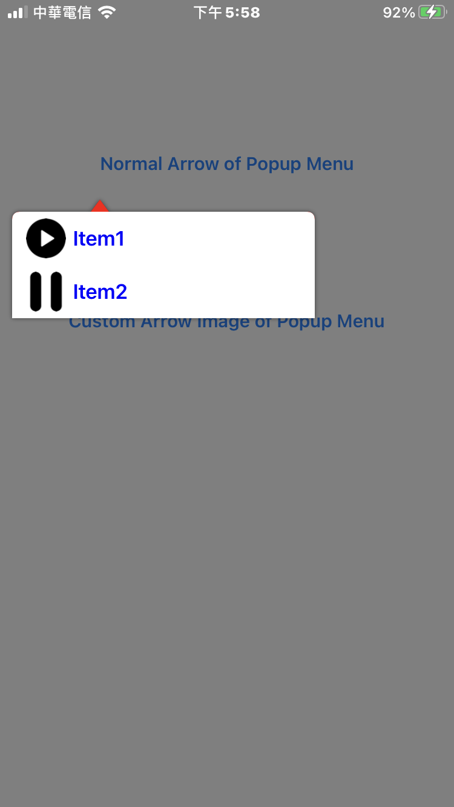
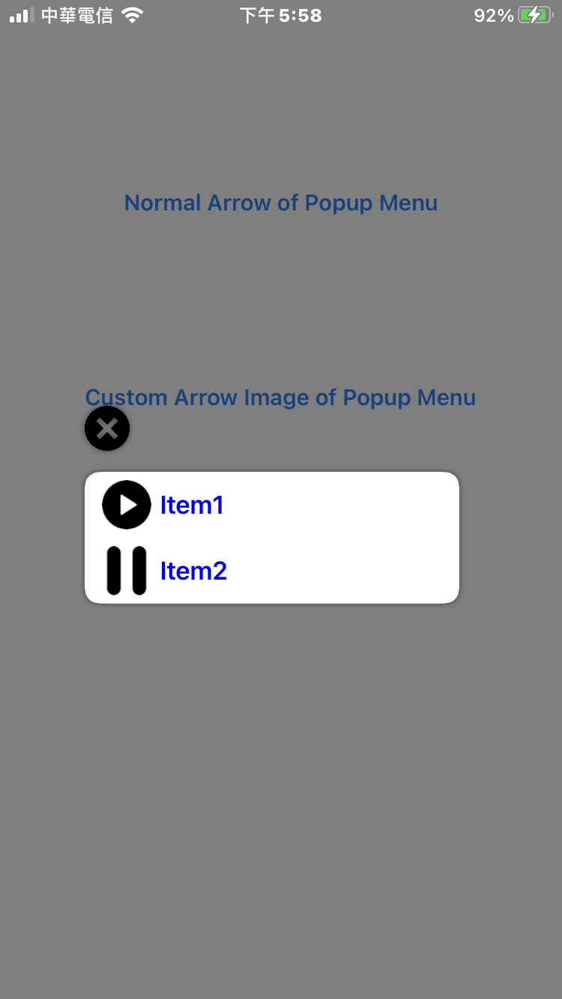

# IRPopupMenu-swift 

- IRPopupMenu-swift is a powerful popup menu for iOS.

## Screenshots
| Demo1 | Demo2 |
|:---:|:---:|
|  |  |

## Features
- Custom items icon and text.
- Custom arrow icon or direction.
- Custom text color.
- Custom dialog's offset.
- Support round corners.
- Support showing shadow.

## Install
### Git
- Git clone this project.
- Copy this project into your own project.
- Add the .xcodeproj into you  project and link it as embed framework.
#### Options
- You can remove the `demo` and `ScreenShots` folder.

### Cocoapods
- Add `pod 'IRPopupMenu-swift'`  in the `Podfile`
- `pod install`

## Usage

### Basic
```swift
import IRPopupMenu_swift

var position = sender.center
position.x = sender.frame.minX
position.y += sender.frame.height

let imageSize = CGSize(width: 30, height: 30)
let settingImage = image(WithImage: UIImage(named: "play")!, scaledToSize: imageSize)
let infoImage = image(WithImage: UIImage(named: "pause")!, scaledToSize: imageSize)
IRPopupMenu.init(showAtPoint: position, titles: ["Item1", "Item2"], icons: [settingImage!, infoImage!], menuWidth: 250) { popupMenu in
    popupMenu.priorityDirection = .IRPopupMenuPriorityDirectionTop
    popupMenu.arrowDirection = .IRPopupMenuArrowDirectionTop
    popupMenu.backColor = .red
    popupMenu.textColor = .blue
    popupMenu.dismissOnSelected = false
    popupMenu.isShowShadow = true
    popupMenu.delegate = self
    popupMenu.offset = 0
    popupMenu.rectCorner = [.topLeft, .topRight]
    popupMenu.cornerRadius = 6
}
```

### Advanced settings
```swift
import IRPopupMenu_swift

var position = sender.center
position.x = sender.frame.minX
position.y += sender.frame.height

let imageSize = CGSize(width: 30, height: 30)
let settingImage = image(WithImage: UIImage(named: "play")!, scaledToSize: imageSize)
let infoImage = image(WithImage: UIImage(named: "pause")!, scaledToSize: imageSize)
IRPopupMenu.init(showAtPoint: position, titles: ["Item1", "Item2"], icons: [settingImage!, infoImage!], menuWidth: 250) { popupMenu in
    let closeButton = UIButton(type: .custom)
    closeButton.setImage(UIImage(named: "close"), for: .normal)
    closeButton.imageView?.contentMode = .scaleAspectFit
    popupMenu.addSubview(closeButton)
    
    NSLayoutConstraint(item: closeButton, attribute: .left, relatedBy: .equal, toItem: popupMenu, attribute: .left, multiplier: 1, constant: 0).isActive = true
    NSLayoutConstraint(item: closeButton, attribute: .bottom, relatedBy: .equal, toItem: popupMenu, attribute: .top, multiplier: 1, constant: -14).isActive = true
    NSLayoutConstraint(item: closeButton, attribute: .height, relatedBy: .equal, toItem: nil, attribute: .notAnAttribute, multiplier: 1, constant: 30).isActive = true
    NSLayoutConstraint(item: closeButton, attribute: .width, relatedBy: .equal, toItem: nil, attribute: .notAnAttribute, multiplier: 1, constant: 30).isActive = true
    closeButton.translatesAutoresizingMaskIntoConstraints = false
    
    popupMenu.priorityDirection = .IRPopupMenuPriorityDirectionNone
    popupMenu.arrowDirection = .IRPopupMenuArrowDirectionNone
    popupMenu.backColor = .red
    popupMenu.textColor = .blue
    popupMenu.dismissOnSelected = false
    popupMenu.isShowShadow = true
    popupMenu.delegate = self
    popupMenu.arrowHeight = 0
    popupMenu.offset = 20
    popupMenu.minSpace = 0
    popupMenu.rectCorner = [.allCorners]
    popupMenu.cornerRadius = 10
}
```

